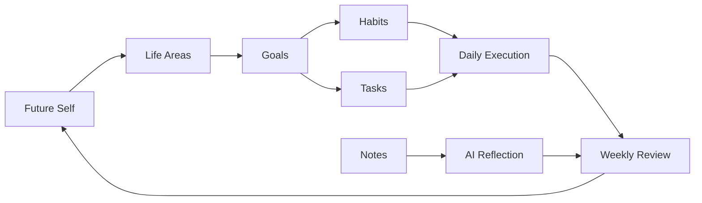
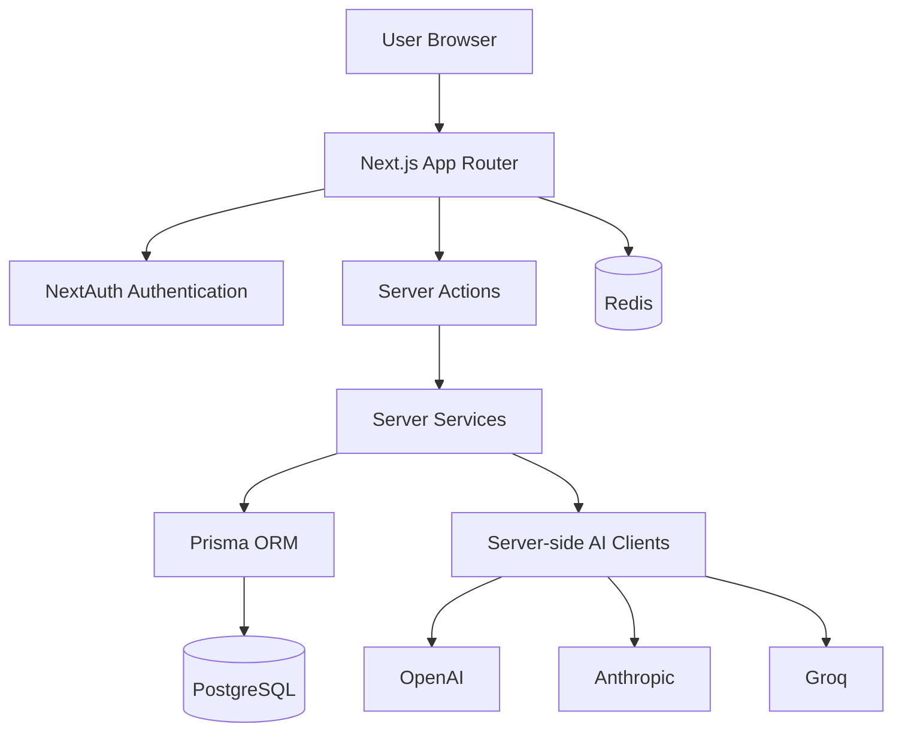
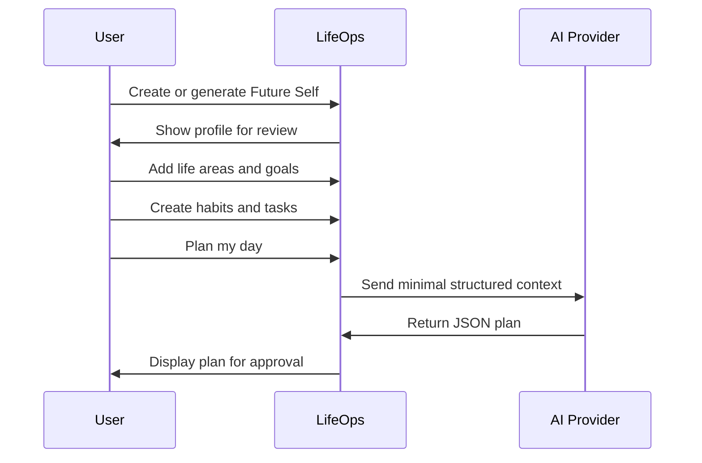
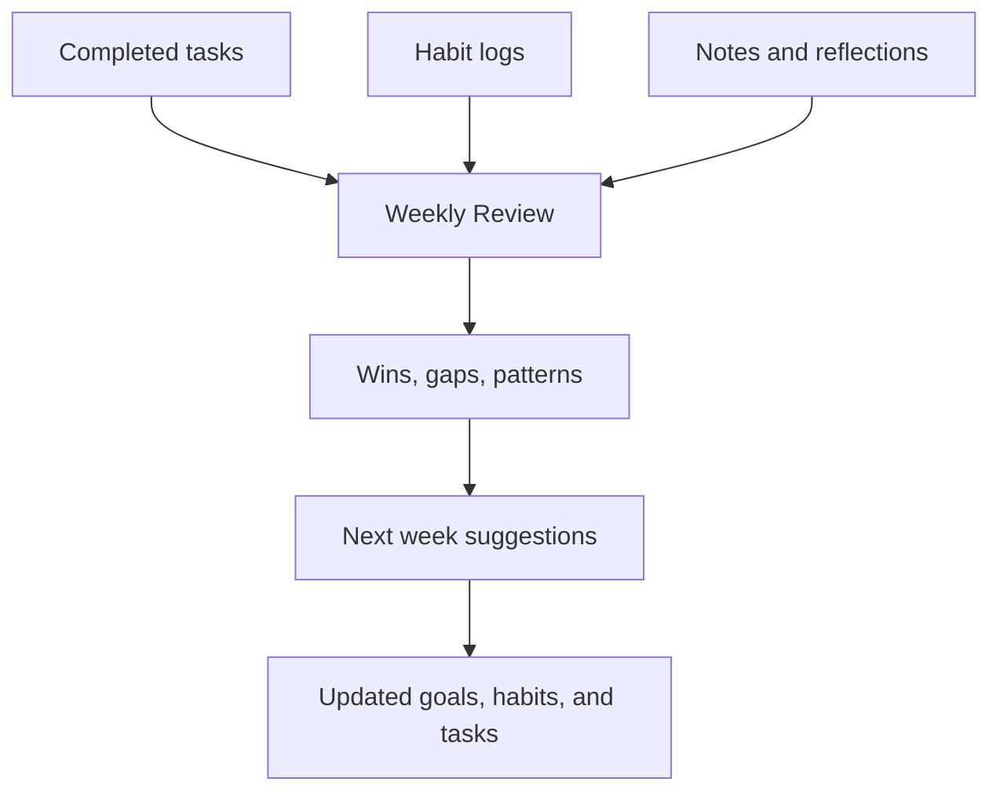

# 🌱 LifeOps

**LifeOps** is an AI-powered personal operating system that connects your future self, goals, habits, tasks, notes, daily planning, and weekly review into one calm dashboard.

Most productivity apps ask, “Did you finish the task?”  
LifeOps asks, **“Is today helping you become the person you said you want to be?”**

---

## ✨ Why LifeOps Is Different

Traditional habit and personal growth apps usually split life into isolated lists:

- Habit trackers measure streaks.
- Task apps manage checkboxes.
- Notes apps store thoughts.
- Goal apps track outcomes.
- AI apps generate suggestions without enough life context.

LifeOps is different because it links all of those layers together:

| Typical App | LifeOps |
| --- | --- |
| Tracks habits in isolation | Connects habits to goals and future identity |
| Stores tasks as a flat list | Links tasks to goals, daily plans, and reviews |
| Treats notes as passive storage | Turns notes into summaries, ideas, and next actions |
| Uses AI as a chatbot | Uses AI inside structured review-before-save workflows |
| Focuses on activity | Focuses on alignment with your future self |

LifeOps is built around one core loop:



---

## 🧭 Core Modules

- 🪞 **Future Self**: Define the identity and life direction you are building toward.
- 🎯 **Goals**: Create measurable outcomes connected to life areas.
- 🔥 **Habits**: Build repeatable actions linked to goals.
- ✅ **Tasks**: Manage concrete work by due date, priority, status, and linked goal.
- 📝 **Notes**: Capture reflections, context, and ideas.
- 📊 **Dashboard**: See today’s actions, active goals, habits, notes, and progress.
- 🧠 **AI Daily Planner**: Generate a reviewable plan for the day.
- 📅 **Weekly Review**: Summarize wins, gaps, patterns, and next week suggestions.
- ⚙️ **Admin**: Manage AI provider settings, key status, cost estimates, and access logs.

---

## 🧩 Architecture



AI calls are server-side only. Generated AI output is structured, validated, and shown to the user for review before saving.

---

## 🔁 User Flows

### Future Self to Daily Action



### Weekly Review Loop



---

## 🛠️ Tech Stack

- **Frontend**: Next.js App Router, React, TypeScript, Tailwind CSS
- **Backend**: Next.js Server Actions, server services
- **Database**: PostgreSQL, Prisma ORM
- **Auth**: NextAuth
- **Validation**: Zod
- **AI Providers**: OpenAI, Anthropic, Groq
- **Local Infrastructure**: Docker Compose with PostgreSQL and Redis
- **Monorepo Tooling**: pnpm workspaces, Turbo

---

## 📁 File Structure

```txt
lifeops-project-cx/
  apps/
    web/
      src/
        app/
          (auth)/
          (dashboard)/
          api/
          globals.css
          icon.svg
          layout.tsx
        components/
          ai/
          dashboard/
          ui/
        lib/
          ai/
          auth/
          db/
          utils.ts
        server/
          actions/
          services/
        types/
  packages/
    ai/
    db/
      prisma/
        migrations/
        schema.prisma
        seed.mjs
      src/
    shared/
      src/
        schemas/
  tests/
  docker-compose.yml
  package.json
  pnpm-workspace.yaml
  turbo.json
```

---

## 🚀 Install And Run

### 1. Install dependencies

```bash
pnpm install
```

### 2. Create environment file

Windows PowerShell:

```powershell
Copy-Item .env.example .env
```

macOS/Linux:

```bash
cp .env.example .env
```

Update `.env` with database, auth, and AI provider values.

### 3. Start local infrastructure

```bash
docker compose up -d
```

This starts:

- PostgreSQL on `localhost:5432`
- Redis on `localhost:6379`

### 4. Generate Prisma client and migrate database

```bash
pnpm db:generate
pnpm db:migrate
```

### 5. Seed local demo data

```bash
pnpm db:seed
```

### 6. Start the app

```bash
pnpm dev
```

Open:

```txt
http://localhost:3000
```

If port `3000` is already busy, Next.js may choose another port such as `3001`.

---

## 🔐 Test Login

After seeding, use:

```txt
Username: admin
Password: password123
```

---

## 🤖 AI Configuration

Open `/admin` to choose the global AI provider and model.

Supported providers:

- Groq
- OpenAI
- Anthropic

Add server-side API keys in `.env`:

```txt
GROQ_API_KEY=
OPENAI_API_KEY=
ANTHROPIC_API_KEY=
```

AI features currently include:

- Generate habits from a goal
- Plan my day
- Generate weekly review
- Summarize note
- Suggest next actions for a goal
- Generate Future Self drafts
- Create tasks from ideas or notes

---

## 🧪 Tests And Quality Checks

Run the full test suite:

```bash
pnpm test
```

Run TypeScript checks across the workspace:

```bash
pnpm typecheck
```

Run the web app typecheck only:

```bash
pnpm --filter @lifeops/web typecheck
```

Useful database commands:

```bash
pnpm db:generate
pnpm db:migrate
pnpm db:seed
pnpm db:studio
```

Recommended before pushing:

```bash
pnpm typecheck
pnpm test
```

---

## 🛡️ Security Notes

LifeOps is designed so sensitive AI and auth behavior stays server-side.

- Never commit `.env` or API keys.
- AI provider keys are read only on the server.
- Client components never receive raw API keys.
- AI-generated goals, habits, tasks, and plans are review-before-save.
- AI output is expected to be structured JSON and validated with Zod.
- User data should always be scoped to the authenticated user.
- PostgreSQL and Redis should run in local Docker or private production networks.
- Admin AI logs should help track provider access, fallback behavior, and estimated cost.

---

## 🧠 Design Philosophy

LifeOps should feel:

- Calm, not noisy
- Guided, not overwhelming
- Dashboard-first
- Useful every day
- Honest about progress
- Focused on becoming, not just completing

The product is not trying to be another task list. It is a personal operating system for connecting identity, intention, execution, and reflection.

---

## 📌 Project Status

LifeOps is currently focused on the MVP:

- Future Self
- Goals
- Habits
- Tasks
- Notes
- Dashboard
- AI Daily Planner
- Weekly Review
- Admin AI settings and usage logs

Future phases may expand automation, integrations, mobile support, and deeper AI workflows, but the MVP intentionally stays focused on personal alignment and daily execution.
